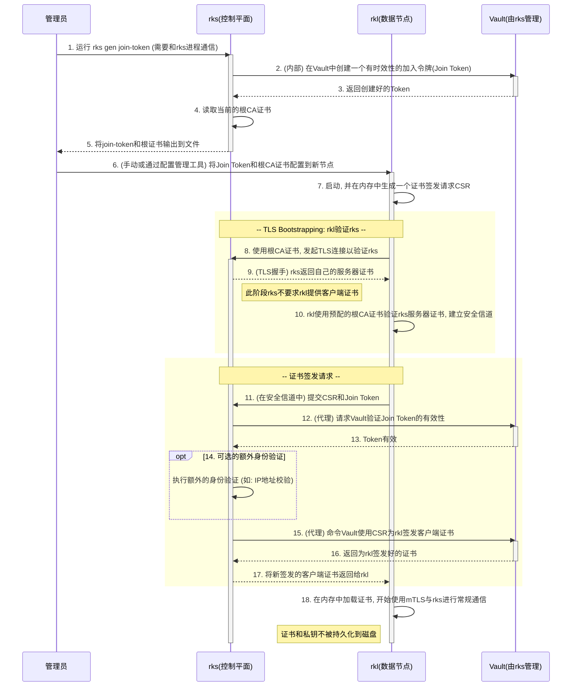
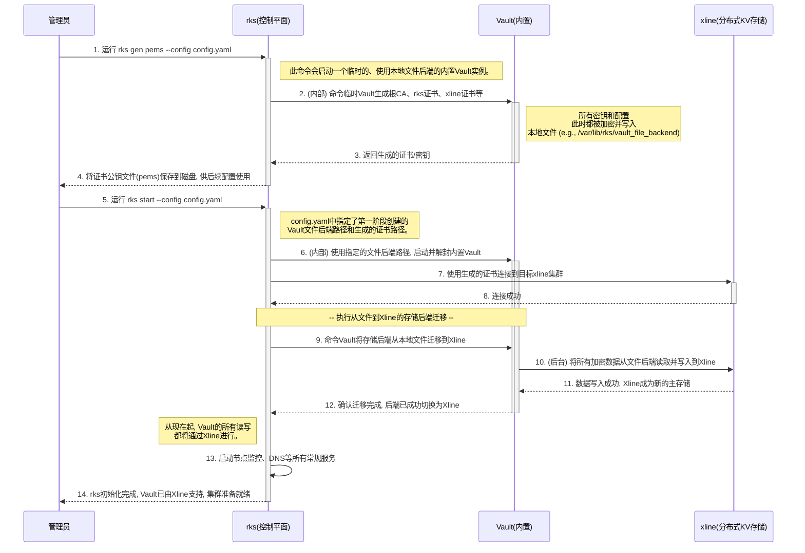

The `libvault` serves as the certificate manager in rk8s.

## Quickstart: Using libvault as a Certificate Manager

The library exposes the same PKI primitives that RustyVault offers, so you can manage a CA and issue leaf certificates entirely in-process. The snippet below shows how to bootstrap a file-backed vault, generate an internal root CA, define a PKI role, and mint a node certificate. It leans on the strong request/response types in `libvault::modules::pki::types` (see `src/modules/pki/types.rs`) to avoid hand-written JSON.

```rust
use std::{collections::HashMap, fs, path::PathBuf};

use anyhow::Result;
use libvault::{
    core::SealConfig,
    modules::pki::types::{
        IssueCertificateRequest,
        IssueCertificateResponse,
        RootGenerateRequest,
    },
    storage,
    RustyVault,
};
use serde::Serialize;
use serde_json::{json, Map, Value};

fn to_payload<T: Serialize>(payload: T) -> Option<Map<String, Value>> {
    serde_json::to_value(payload).ok()?.as_object().cloned()
}

#[tokio::main]
async fn main() -> Result<()> {
    // 1) Bring up a lightweight file backend for demos/tests.
    let storage_dir: PathBuf = std::env::temp_dir().join("libvault-demo");
    fs::create_dir_all(&storage_dir)?;
    let mut backend_cfg = HashMap::new();
    backend_cfg.insert(
        "path".to_string(),
        Value::String(storage_dir.display().to_string()),
    );
    let backend = storage::new_backend("file", &backend_cfg)?;

    // 2) Initialize + unseal the vault so we can use the built-in PKI module.
    let vault = RustyVault::new(backend, None)?;
    let seal = SealConfig { secret_shares: 1, secret_threshold: 1 };
    let init = vault.init(&seal).await?;
    let unseal_key = init.secret_shares[0].clone();
    vault.unseal(&[unseal_key.as_slice()]).await?;
    vault.set_token(init.root_token.clone()); // future calls can pass `None` for the token

    // 3) Create an internal root CA.
    let ca_req = RootGenerateRequest {
        common_name: Some("rk8s Demo Root CA".into()),
        ttl: Some("8760h".into()),
        ..Default::default()
    };
    vault
        .write::<String>(None, "pki/root/generate/internal", to_payload(ca_req))
        .await?;

    // 4) Define a role that limits which identities can request certs.
    let role_payload = json!({
        "allowed_domains": "svc.rk8s.local",
        "allow_subdomains": true,
        "allow_any_name": false,
        "server_flag": true,
        "client_flag": true,
        "ttl": "24h",
        "max_ttl": "720h",
        "no_store": true
    })
    .as_object()
    .cloned();
    vault
        .write::<String>(None, "pki/roles/rk8s-nodes", role_payload)
        .await?;

    // 5) Issue a leaf certificate for a control-plane node.
    let issue_req = IssueCertificateRequest {
        common_name: Some("node-01.svc.rk8s.local".into()),
        alt_names: Some("node-01.svc.rk8s.local,node-01".into()),
        ip_sans: Some("10.40.0.10".into()),
        ttl: Some("12h".into()),
    };
    let response = vault
        .write::<String>(None, "pki/issue/rk8s-nodes", to_payload(issue_req))
        .await?
        .and_then(|resp| resp.data)
        .expect("PKI issue response");
    let issued: IssueCertificateResponse = serde_json::from_value(Value::Object(response))?;

    println!("Issued leaf cert:\n{}", issued.certificate);
    println!("Encrypted private key:\n{}", issued.private_key);
    println!("Chain length: {}", issued.to_certs()?.len());

    Ok(())
}
```

The same flow works with the optional `storage_mysql` or `storage_sqlx` features if you prefer to persist CA state in an external database instead of the file backend.

## Example: Installing QUIC Certificates for RK8s

The RK8s control plane (`rks`) and workers (`rkl`) use QUIC with mutual TLS. The end-to-end workflow is split across `rk8s/project/rks` and `rk8s/project/rkl`, but every step ultimately calls back into libvault's PKI module (`libvault::modules::pki::types`). The diagram below summarizes the lifecycle.

```
┌──────────────┐                                ┌───────────────┐
│    RKS       │                                │     RKL       │
│ (control)    │                                │  (worker)     │
└────┬─────────┘                                └────────┬──────┘
     │ rks gen certs --config config.yaml              │
     │  • Vault::generate_certs mounts pki             │
     │  • Writes root.pem/root.key/keys.json          │
     │  • Publishes pki/roles/{rks,rkl,xline}-node    │
     │                                                │ obtain join token via
     │ rks gen join-token → join.token                │   `rks gen join-token`
     │ copy root.pem to workers                       │
     │                                                │ start QUIC bootstrap:
     │ rks start --config …                           │ `rkl … --enable-tls \
     │  • node/cert.rs: build_quic_config()           │   --root-cert-path /etc/rk8s/root.pem \
     │    issues short-lived server certs             │   --join-token $(cat join.token)`
     │                                                │
     │<────────────── QUIC stage 1 ────────────────┐   │
     │  build_handshake_config(None)               │   │
     │  (no client cert yet)                       │   │
     │                                            resp │
     │ RksMessage::CertificateSign { req, token } ◀───┘
     │   node/server.rs: validates token, issues role=rkl cert via libvault
     │
     │─────────────── QUIC stage 2 ───────────────▶│
     │  rkl rebuilds config with IssueCertificateResponse::to_certs()
     │  (client auth)                               │
     │<──────────── steady-state QUIC ─────────────▶│
```

### Control-plane steps (on the RKS host)

1. **Generate the PKI bundle** – `rks gen certs config.yaml` calls `Vault::generate_certs` (`rk8s/project/rks/src/vault.rs:205`) which in turn mounts `pki/`, creates the root CA via `libvault`'s `RootGenerateRequest`, persists `root.pem`, `root.key`, `keys.json` and writes role policies for `rks`, `rkl`, and `xline` (`vault.write_policy`).
2. **Distribute trust anchors** – copy `root.pem` (and, if needed, per-xline certs) from `vault_folder` to `/etc/rk8s/certs/root.pem` on every worker.
3. **Mint join tokens** – `rks gen join-token` wraps `Vault::generate_once_token`, producing a single-use token that gate-keeps certificate requests (`rk8s/project/rks/src/vault.rs:239`).
4. **Start the QUIC endpoint** – `rks start --config …` reaches `node/cert.rs:35`. When TLS is enabled, `build_quic_config()`:
   - Asks libvault for an `IssueCertificateResponse` with `common_name = "rks-cluster"` and the actual `addr` SANs (`IssueCertificateRequest` from `libvault::modules::pki::types`).
   - Builds a `rustls::ServerConfig` and hands it to quinn, caching the chain so `QUICServer::rotate_background` can renew it before expiry (`rks/src/node/server.rs:23`).

### Worker steps (on each RKL host)

1. **Launch with TLS flags** – every CLI/daemon entry point accepts `TLSConnectionArgs` (`rk8s/project/rkl/src/commands/pod/mod.rs:21`). Provide the join token and root certificate path:
   ```bash
   sudo RKS_ADDRESS=10.20.173.26:50051 \
        rkl pod daemon \
        --enable-tls \
        --root-cert-path /etc/rk8s/certs/root.pem \
        --join-token $(cat /etc/rk8s/join.token)
   ```
2. **Stage 1 QUIC handshake** – `QUICClient::connect` (`rkl/src/quic/client.rs:71`) first calls `build_handshake_config(root.pem)` to trust the RKS server certificate but advertises no client auth yet.
3. **Request a node certificate** – the provisional connection sends `RksMessage::CertificateSign { token, req }` with the same `IssueCertificateRequest` type used server-side (`rkl/src/quic/client.rs:108`). RKS validates the token in `AuthConnection<Unauthenticated>::serve` (`rks/src/node/server.rs:210`) and replies with `IssueCertificateResponse`.
4. **Install and reconnect** – `QUICClient::request_certificate` converts the response into `rustls` material via `IssueCertificateResponse::to_certs()`, builds a `ClientConfig::with_client_auth_cert`, and repeats the QUIC dial. From this point, every message (NodeRegister, Heartbeat, CreatePod, etc.) rides on a mutually-authenticated transport.

Because both sides use libvault for minting and parsing (`CertExt::to_certs`), certificate rotation is automatic: RKS refreshes its server cert when two thirds of the TTL elapse, and RKL can request a new leaf at any time by reopening stage 1. This keeps QUIC connections aligned with libvault's PKI source of truth.

### Code sample: minimal QUIC pair backed by libvault

```rust
use std::{collections::HashMap, net::SocketAddr, sync::Arc, time::Duration};

use anyhow::Result;
use libvault::{
    core::SealConfig,
    modules::pki::types::{IssueCertificateRequest, IssueCertificateResponse, RootGenerateRequest},
    storage,
    RustyVault,
};
use quinn::{Endpoint, ServerConfig};
use rustls::pki_types::{pem::PemObject, CertificateDer, PrivateKeyDer};
use rustls::{server::WebPkiClientVerifier, RootCertStore};
use serde_json::{json, Map, Value};
use tokio::{
    io::{AsyncReadExt, AsyncWriteExt},
    task,
};

fn obj<T: serde::Serialize>(value: T) -> Option<Map<String, Value>> {
    serde_json::to_value(value).ok()?.as_object().cloned()
}

struct CertMaterial {
    certs: Vec<CertificateDer<'static>>,
    private_key: PrivateKeyDer<'static>,
}

impl From<IssueCertificateResponse> for CertMaterial {
    fn from(resp: IssueCertificateResponse) -> Self {
        let certs = resp.to_certs().expect("invalid cert chain");
        let private_key = PrivateKeyDer::from_pem_slice(resp.private_key.as_bytes()).unwrap();
        Self { certs, private_key }
    }
}

#[tokio::main]
async fn main() -> Result<()> {
    // --- 1) bootstrap libvault with a temp file backend ---
    let mut cfg = HashMap::new();
    let path = tempfile::tempdir()?;
    cfg.insert("path".into(), Value::String(path.path().display().to_string()));
    let backend = storage::new_backend("file", &cfg)?;

    let vault = RustyVault::new(backend.clone(), None)?;
    let init = vault.init(&SealConfig { secret_shares: 1, secret_threshold: 1 }).await?;
    let unseal = init.secret_shares[0].clone();
    vault.unseal(&[unseal.as_slice()]).await?;
    vault.set_token(init.root_token.clone());
    vault.mount::<&str>(None, "pki", "pki").await?;

    // Root CA and roles for server/client.
    vault
        .write::<String>(None, "pki/root/generate/internal", obj(RootGenerateRequest {
            common_name: Some("rk8s demo root".into()),
            ttl: Some("8760h".into()),
            ..Default::default()
        }))
        .await?;
    let role_body = json!({
        "allow_any_name": true,
        "allow_ip_sans": true,
        "server_flag": true,
        "client_flag": true,
        "max_ttl": "720h",
        "ttl": "24h",
    })
    .as_object()
    .cloned();
    vault.write::<String>(None, "pki/roles/quic-server", role_body.clone()).await?;
    vault.write::<String>(None, "pki/roles/quic-client", role_body).await?;

    // Issue cert chains for both ends.
    let server_cert: CertMaterial = vault
        .write::<String>(
            None,
            "pki/issue/quic-server",
            obj(IssueCertificateRequest {
                common_name: Some("rks.local".into()),
                alt_names: Some("localhost".into()),
                ttl: Some("1h".into()),
                ..Default::default()
            }),
        )
        .await?
        .map(|resp| serde_json::from_value(Value::Object(resp.data.unwrap())).unwrap())
        .map(CertMaterial::from)
        .unwrap();
    let client_cert: CertMaterial = vault
        .write::<String>(
            None,
            "pki/issue/quic-client",
            obj(IssueCertificateRequest {
                common_name: Some("worker-01".into()),
                ttl: Some("1h".into()),
                ..Default::default()
            }),
        )
        .await?
        .map(|resp| serde_json::from_value(Value::Object(resp.data.unwrap())).unwrap())
        .map(CertMaterial::from)
        .unwrap();

    // Build trust store from the CA that signed the server leaf.
    let mut roots = RootCertStore::empty();
    for cert in server_cert.certs.iter().skip(1) {
        roots.add(cert.clone())?;
    }

    // --- 2) configure QUIC server with mutual TLS ---
    let verifier = WebPkiClientVerifier::builder(Arc::new(roots.clone()))
        .allow_unauthenticated()
        .build()?;
    let server_crypto = rustls::ServerConfig::builder()
        .with_client_cert_verifier(verifier)
        .with_single_cert(server_cert.certs.clone(), server_cert.private_key.clone())?;
    let mut server_endpoint = Endpoint::server(
        ServerConfig::with_crypto(Arc::new(quinn::crypto::rustls::QuicServerConfig::try_from(
            server_crypto,
        )?)),
        "127.0.0.1:50055".parse::<SocketAddr>()?,
    )?;

    // Spawn accept loop.
    task::spawn(async move {
        while let Some(connecting) = server_endpoint.accept().await {
            tokio::spawn(async move {
                let connection = connecting.await.expect("handshake");
                let mut uni = connection.accept_uni().await.expect("uni stream");
                let mut buf = vec![0u8; 5];
                uni.read_exact(&mut buf).await.unwrap();
                println!("server received: {}", String::from_utf8_lossy(&buf));
            });
        }
    });

    // --- 3) connect the QUIC client with its own certificate ---
    let client_crypto = rustls::ClientConfig::builder()
        .with_root_certificates(roots)
        .with_client_auth_cert(client_cert.certs, client_cert.private_key)?;
    let mut client = Endpoint::client("0.0.0.0:0".parse()?)?;
    client.set_default_client_config(quinn::ClientConfig::new(Arc::new(
        quinn::crypto::rustls::QuicClientConfig::try_from(client_crypto)?,
    )));

    let conn = client
        .connect("127.0.0.1:50055".parse()?, "rks.local")?
        .await?;
    let mut send = conn.open_uni().await?;
    send.write_all(b"hello").await?;
    send.finish()?;

    tokio::time::sleep(Duration::from_millis(200)).await;
    Ok(())
}
```

This single file mirrors the production flow: libvault issues server/client chains (`IssueCertificateRequest`), converts `IssueCertificateResponse` into `rustls` material, and quinn provides QUIC transport with mutual TLS enforced by the root CA created in place.

## RKS initialization 



## RKL Node join 


